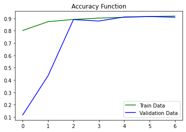
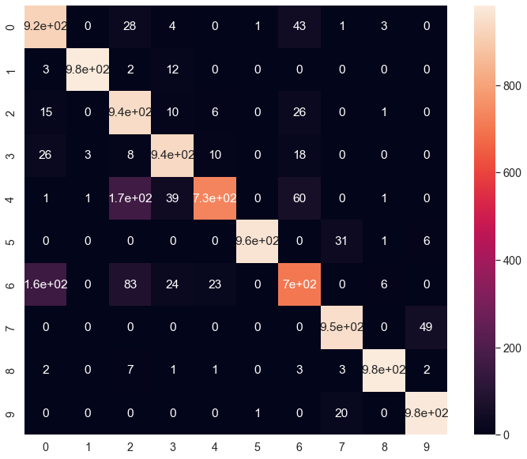

# CNN on Fashion MNIST Dataset

[Dataset on kaggle](https://www.kaggle.com/datasets/zalando-research/fashionmnist)

## Contents
### Data Cleaning
In this part we just load and reshape the dataset

### Data Preprocessing
* Scaling
* Encoding

### Modeling
1. First block
    * Zero padding layer
    * Convolution layer with 32 kernels
    * Batch normalization layer
    * Dropout layer
    * Max pooling layer

2. Second block
   * Zero padding layer
   * Convolution layer with 64 kernels
   * Batch normalization layer
   * Dropout layer
   * Max pooling layer

3. Third block
   * Flatten layer
   * Dense layer with 128 units
   * Dropout layer
   * Dense layer with 10 units

We use adam optimizer and categorical cross entropy as loss
### Evaluation
* Accuracy plot
* 

* Classification report (91% accuracy)

* Confusion matrix

* 